## Proceso ETL
Como dice ana maria bisbe york es un proceso como un castillo de arena se trae la arena se trae los datos, etc.

- Extraer: De muchas fuentes de datos
- Transformar: Como un embudo donde hay clientes potenciales, separación por departamento.
- Cargar: Se crea un gráfico para tomar decisiones rápidas.

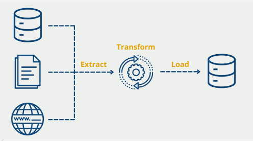

## Power BI

Ayuda a crear a los puestos de trabajo, a crear informes y cuadros de mando

## Componentes de Power BI

- Power BI Desktop donde se ve todo el proceso ETL, darle un aspecto visual a los gráficos.
- Power BI Service: Te ayuda a colaborar en línea.
- Power BI Mobile: Se puede visualizar desde el celular lo que se ha creado.

## Tips:
- El power Query es el motor de preparación de datos de Power BI de manera estructural.
- Es mejor descargar Power Bi Desktop desde Microsoft Store, ya que ahí se actualiza automáticamente. 
- Mientras que la tabla esta en la web va a tomar más tiempo conectarse.

## Probando Power Bi:

Se inicia sección si perteneces a una organización. Se llama services que se guarda en la nube.

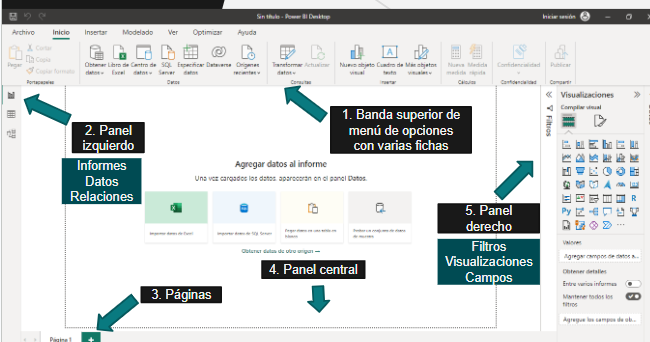

## Ejemplo financiero con Power Bi
https://docs.microsoft.com/en-us/power-bi/create-reports/sample-financial-download

Para conectar a diferentes tipos de archivos

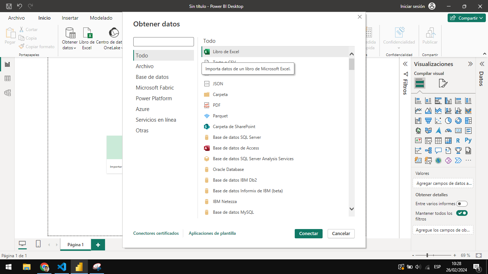

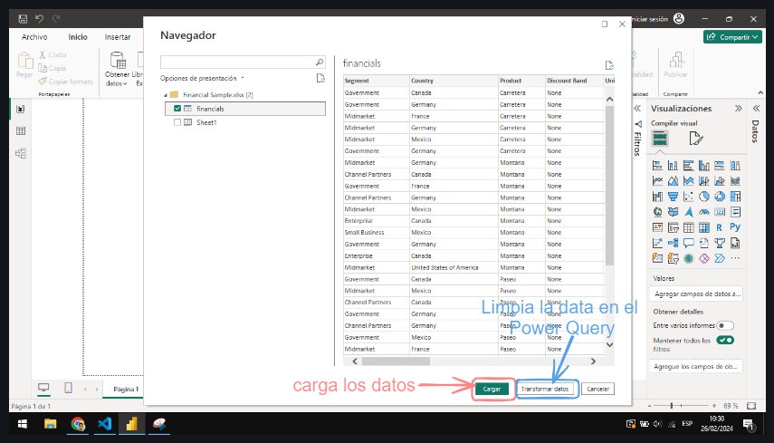

Haciendo el primer gráfico de anillo

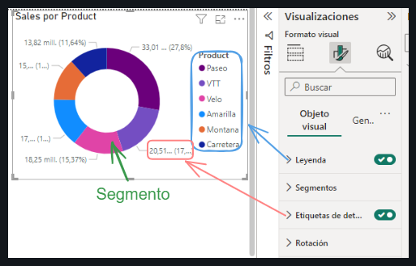

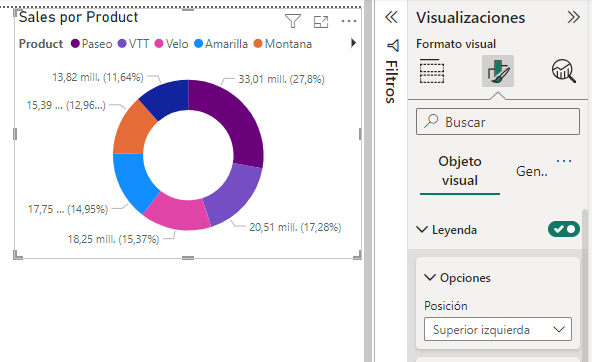

Haciendo la primera matriz

- Se puede hacer subdiviciones es decir agregar operaciones

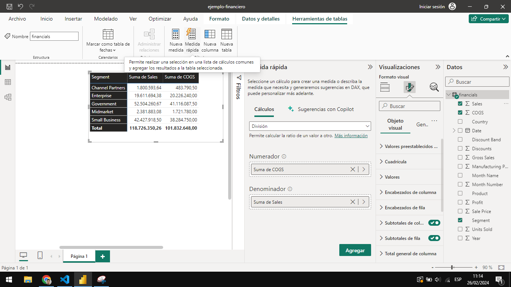

- Una vez agregado aparece esto
  
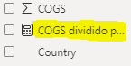 

- Poner barra de datos y se cambia de color selecionando en el icono

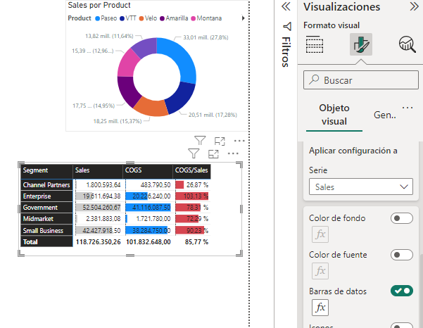

Realizando un gráfico para columnas agrupadas y de línea

- Expandir el nivel de la jerarquia a meses ,trimestres.
  
  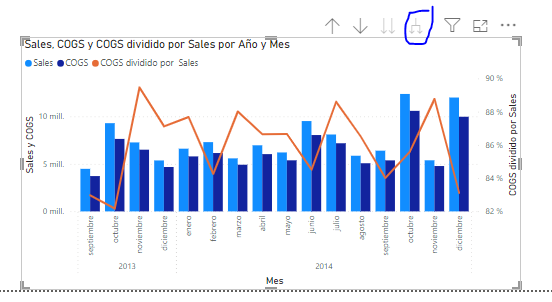

- El espacio vertical se desperdicia y se utiliza para ver el año y el mes junto

    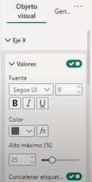
    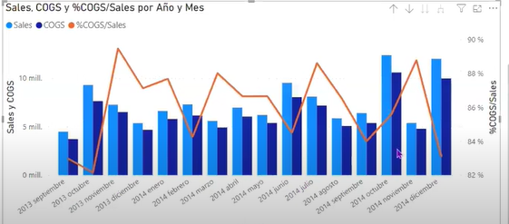

Utilizando el Mapa

- Si son pocos se activa las etiquetas de cátegoria y se borra la leyenda.

Utilizando la segementación de datos:

- En estilo se pone lista vertical

Utilizando la tarjeta

- Para mostrar información de una manera impactante

Para que todos los gráficos tengan interacciones se tiene que dar a formato > editar interacciones 

- Se seleciona el icono en cada gráfico. 

Avance final:

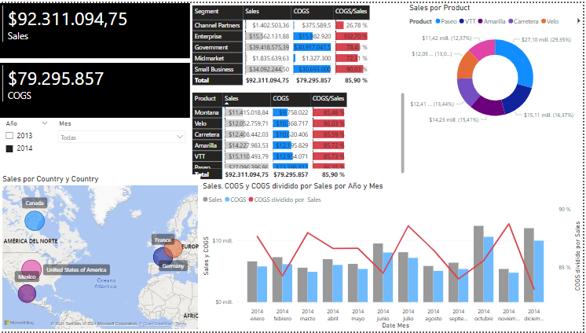
